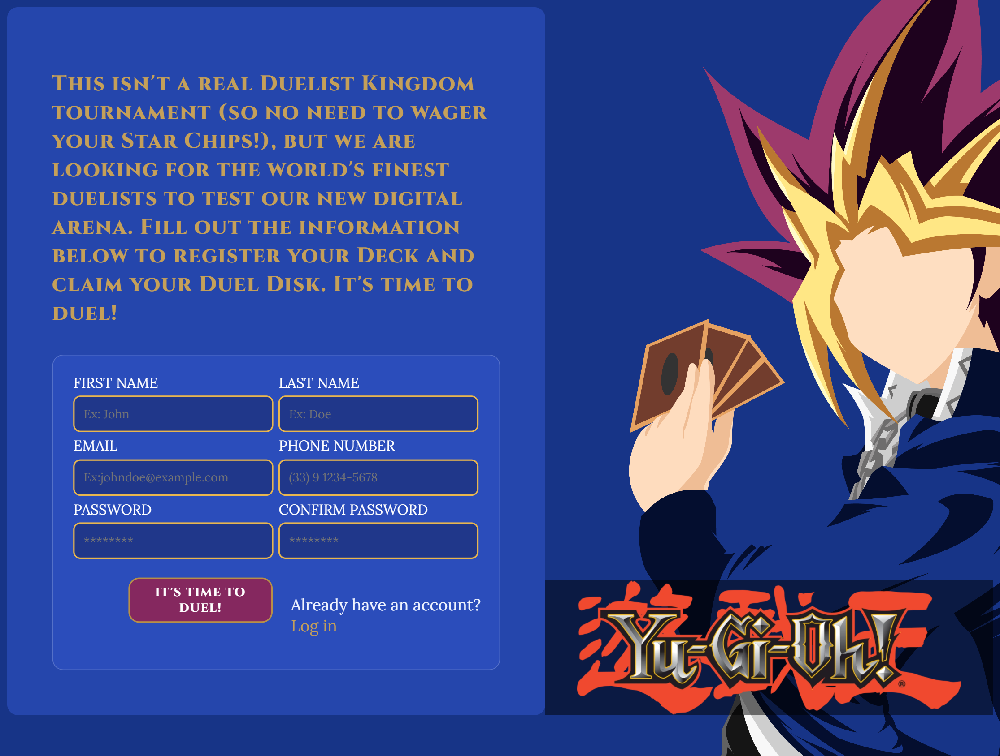

# 🃏 Duelist Kingdom Registration Form

This project is a custom implementation of the Sign-up Form project from **The Odin Project's** Full Stack JavaScript curriculum. It focuses on mastering HTML form validation, accessibility, CSS Flexbox layouts, and building an immersive user interface based on the world of Yu-Gi-Oh!

---

## 🚀 About the Project

Welcome to the digital arena! While this isn't a real Duelist Kingdom tournament (no need to wager your Star Chips just yet!), this form allows the world's finest duelists to register their Decks and claim their Duel Disks.

The project showcases custom inputs, focus and blur transitions, and responsive validation techniques using modern CSS pseudo-classes.

---

## 📸 Preview

Here is a look at the final design of the registration page:

---

## 🛠️ Technologies Used

- **HTML5:** Semantic form structure and native validation attributes (`required`, types).
- **CSS3:** Flexbox for split-screen layout, custom shadows, and state pseudo-classes (`:focus`, `:user-invalid`).
- **Google Fonts:** For thematic typography.

---

## 🎖️ Credits & Acknowledgments

- **Project Developer:** [Felipe Muraoka](https://github.com/muraoka2016)
- **Background Artwork:** Massimiliano Princiotta (all rights reserved to the artist).
- **Yu-Gi-Oh! Assets:** Franchise owned by Konami and Kazuki Takahashi.
- **Education Platform:** [[The Odin Project](https://www.theodinproject.com/](https://www.theodinproject.com/lessons/node-path-intermediate-html-and-css-sign-up-form)) for the project guidelines.
